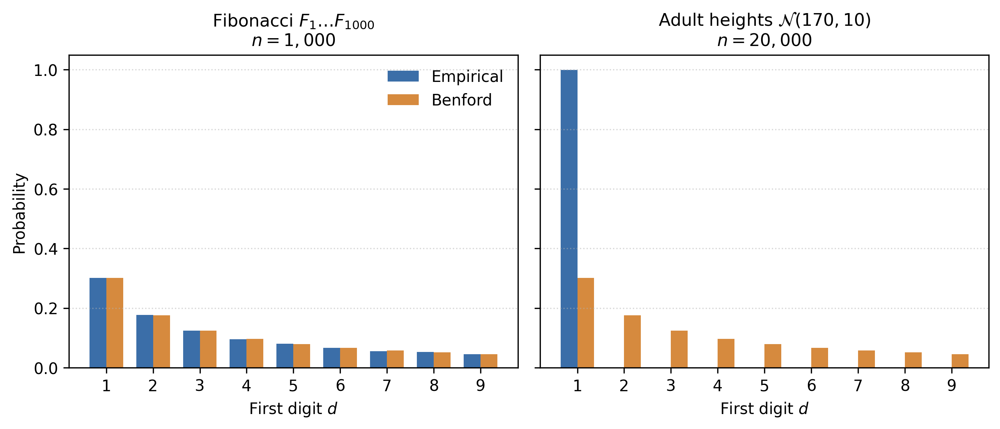
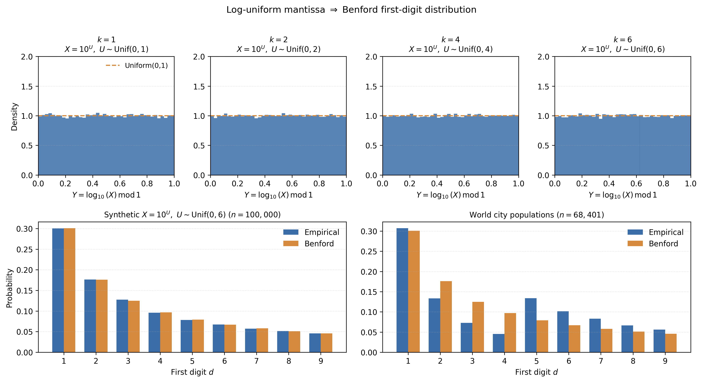
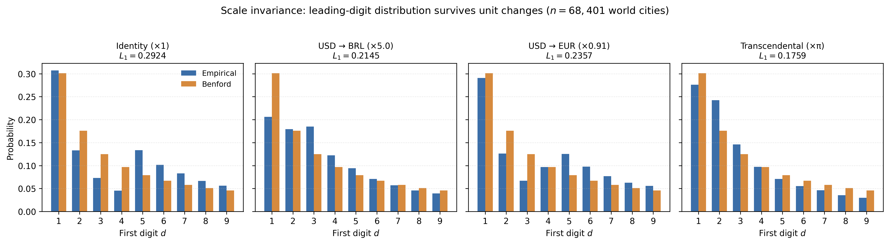
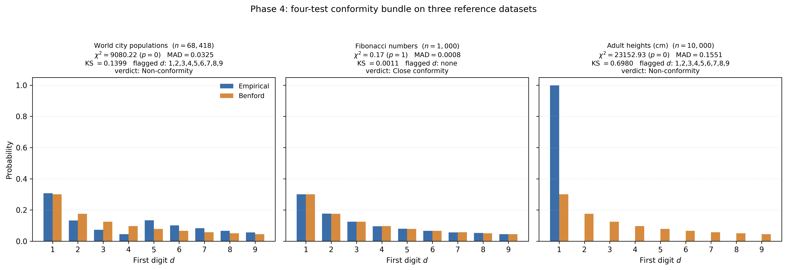
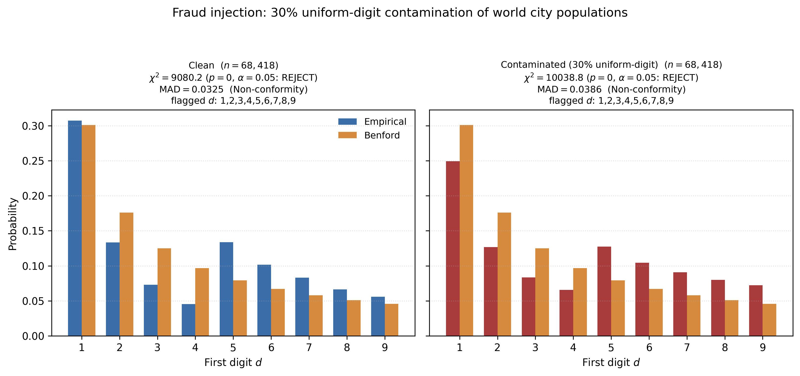
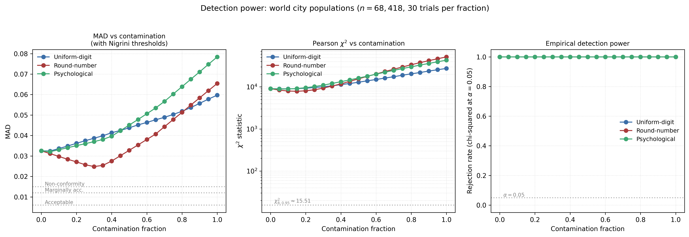

# Lei de Benford: duas derivações, quatro testes, um detector de fraude

> O primeiro dígito de dados numéricos "naturais" não é uniforme, mas logarítmico: $P(d) = \log_{10}(1 + 1/d)$, de modo que um 1 inicial ocorre cerca de 30 % das vezes e um 9 inicial menos de 5 %. Este TIL apresenta duas derivações rigorosas independentes, quatro testes de conformidade e uma demonstração ponta a ponta de detecção de fraude.

---

## Por que escrever sobre isso

Reli *O Andar do Bêbado* recentemente e voltei a tropeçar no parágrafo em que Mlodinow menciona, quase de passagem, a Lei de Benford — aquela ideia desconfortável de que o primeiro dígito de "qualquer" conjunto de dados naturais não é distribuído uniformemente, mas segue uma curva logarítmica. Da primeira leitura eu havia aceitado o fato como curiosidade; desta vez quis entender por que. O que começou como uma anotação de margem virou este TIL: uma tentativa honesta de reconstruir a lei a partir de dois argumentos independentes, ver os dados se ajustarem à curva, e fechar o ciclo com uma aplicação concreta — detecção de fraude. O que segue é o caderno limpo dessa releitura.

---

## 1. As páginas gastas de uma tábua de logaritmos

Em 1881 o astrônomo Simon Newcomb percebeu algo estranho ao folhear seu exemplar de uma tábua de logaritmos. As primeiras páginas — aquelas para números começando com 1 — estavam imundas e com as pontas dobradas; as últimas páginas, para números começando com 9, estavam limpas e intactas. Uma tábua de logaritmos é a mais teimosamente mecânica das referências. Não há enredo, nem narrativa, nenhuma forma de alguns capítulos serem mais interessantes que outros. Por que, então, as primeiras páginas estavam gastas?

Newcomb escreveu uma nota de duas páginas no *American Journal of Mathematics* argumentando que o primeiro dígito significativo de dados numéricos "naturais" não é uniforme, mas logarítmico:

$$
P(d) = \log_{10}\left(1 + \frac{1}{d}\right), \qquad d = 1, 2, \ldots, 9.
$$

O 1 inicial deveria aparecer cerca de 30,1 % das vezes; o 9 inicial, menos de 5 %. A "demonstração" de Newcomb era uma heurística sobre a mantissa de um número aleatório ser uniforme; ele não apresentou argumento formal nem dados empíricos, e a nota deslizou para a obscuridade.

Frank Benford redescobriu a regularidade em 1938 pela ponta oposta. Físico da General Electric, ele tabulou dígitos iniciais em vinte conjuntos de dados não correlacionados — comprimentos de rios, pesos atômicos, estatísticas de beisebol, áreas de superfície de países — e mostrou que a mesma curva logarítmica se ajustava a todos. Benford também não derivou a fórmula; o que ele forneceu foi a massa empírica de evidência que Newcomb havia pulado. O padrão recebeu o nome dele, não o de Newcomb.

A justificação matemática esperou até 1961, quando Roger Pinkham provou que qualquer lei de dígito inicial que não dependa da unidade de medida tem de ser a curva de Benford. Esse argumento — *invariância de escala força a lei* — é o que faz Benford ser mais que um teorema folclórico. É a razão de este TIL existir: a mesma distribuição logarítmica aparece em duas derivações não correlacionadas, uma probabilística e outra estrutural, e o fato de elas se encontrarem é a evidência mais forte possível de que a lei não é coincidência.

O resto é detalhe.

---

## 2. Benford empírico em três conjuntos de dados

Antes de qualquer derivação vale parar para olhar os dados. Benford alinhou vinte conjuntos heterogêneos para mostrar que a curva logarítmica era empírica, não inventada; vou repetir o gesto em escala menor com três conjuntos escolhidos para cobrir três regimes distintos. O primeiro é um caso real desordenado — populações de cidades do mundo —, em que o processo gerador é multiplicativo e cobre várias ordens de magnitude. O segundo é uma sequência analítica limpa — Fibonacci — onde Benford aparece como teorema, não como acaso. O terceiro é um controle negativo deliberado — alturas de adultos — em que a lei *não deve* aparecer, e o painel correspondente serve para fixar o que falha quando o regime multiplicativo é abandonado. A figura abaixo sobrepõe, em cada painel, a frequência empírica de primeiro dígito (azul) e a PMF teórica de Benford (laranja); o que o leitor deve buscar é a aderência das duas séries no primeiro e no segundo painel, e a discrepância gritante no terceiro.

**Populações de cidades do mundo.** O snapshot empacotado do GeoNames `cities5000` lista cerca de 68.000 cidades com pelo menos 5.000 habitantes. O empírico $\hat P(1) \approx 0{,}31$, $\hat P(9) \approx 0{,}06$, monotonamente decrescente exceto por um pequeno pico em $d = 5$ (artefato do corte de 5.000 habitantes — toda cidade *logo acima* do limiar tem 5 inicial). Este é o exemplo canônico: dados geográficos reais cobrindo várias ordens de magnitude (de $10^3$ a $10^7$), originados do mesmo processo multiplicativo de crescimento entre continentes.

**Números de Fibonacci.** $F_1, \ldots, F_{1000}$, computados via fórmula fechada de Binet. A distribuição de primeiro dígito é *exatamente* Benford no limite: o teorema da equidistribuição de Weyl diz que a sequência $n \log_{10}(\varphi) \bmod 1$ é equidistribuída em $[0, 1)$, e a §3 transformará isso na PMF de Benford diretamente. Mesmo para $n = 1000$ o ajuste empírico fica dentro de cerca de 4 % por célula.

**Alturas de adultos.** Sintético, $n = 10{.}000$, $\mathcal{N}(170, 10)$ centímetros. *Não* é Benford: como praticamente todos os valores ficam entre 150 e 190 cm, todos começam com 1, e o painel correspondente do gráfico mostra exatamente isso — uma única barra azul gigante em $d = 1$ e zeros nos demais dígitos, enquanto a curva laranja de Benford se espalha do 1 ao 9. O contraste visual é o ponto: a barra solitária revela um conjunto que vive em escala aditiva, em uma única ordem de magnitude, e portanto está fora do regime onde a lei se aplica. $\hat P(1) > 0{,}55$ e vários dígitos ficam ausentes por completo. Este é o controle negativo — a classe de dados a que Benford explicitamente não se aplica.

As três curvas capturam a faixa operacional. Benford aparece sempre que os dados cobrem várias ordens de magnitude *multiplicativamente*. Falha onde os dados vivem numa escala aditiva de quantidades semelhantes (alturas, pontuações de QI, notas de prova). As próximas duas seções derivam a razão matemática para essa divisão.

---

## 3. Primeira derivação: a mantissa é uniforme em $[0, 1)$

A intuição original de Newcomb era de natureza geométrica: o primeiro dígito de um número depende apenas de onde ele cai dentro de uma "década" — o intervalo entre duas potências consecutivas de dez. Para tornar essa intuição precisa precisamos de uma coordenada que enxergue só essa posição relativa, ignorando a ordem de magnitude. O logaritmo faz exatamente isso, e dele sai a derivação inteira em poucos passos.

Escreva qualquer real positivo $X$ em notação científica:

$$
X = r \cdot 10^k, \qquad r \in [1, 10), \quad k \in \mathbb{Z}.
$$

O fator $r$ é a **mantissa** e $k$ a ordem de magnitude. O primeiro dígito significativo de $X$ é simplesmente $\lfloor r \rfloor$ (a *função piso*, que retorna o maior inteiro menor ou igual a $r$); denotamos essa operação por $D(X) := \lfloor r \rfloor$ e, quando $X$ for aleatório, tratamos $D$ como variável aleatória derivada — é o objeto cuja distribuição queremos descobrir. Toda a informação relevante para nossa pergunta vive em $r$: multiplicar $X$ por uma potência de dez muda $k$ mas não toca em $r$, nem no primeiro dígito. Tomando logaritmos transformamos esse fato em álgebra:

$$
\log_{10}(X) = \log_{10}(r) + k, \qquad \log_{10}(r) \in [0, 1).
$$

A ordem de magnitude $k$ vira a parte inteira do logaritmo, e a parte fracionária guarda toda a informação sobre o primeiro dígito. Essa parte fracionária merece um nome próprio. Defina a **log-mantissa** $Y = \log_{10}(X) \bmod 1$. Por construção $Y \in [0, 1)$, e o intervalo $[0, 1)$ se particiona naturalmente em nove subintervalos, um para cada dígito inicial:

$$
D(X) = d \iff \log_{10}(d) \le Y < \log_{10}(d + 1).
$$

O comprimento do $d$-ésimo subintervalo é exatamente $\log_{10}(d+1) - \log_{10}(d) = \log_{10}(1 + 1/d)$ — a fórmula de Benford já está lá, esperando uma medida de probabilidade que peso esses comprimentos. Até aqui, porém, tudo é tradução: nenhuma probabilidade foi introduzida. A passagem seguinte é o único lugar do argumento onde uma hipótese substantiva entra.

**Premissa (mantissa log-uniforme).** Assuma que a log-mantissa $Y$ se distribui uniformemente em $[0, 1)$, isto é,

$$
Y \sim \mathrm{Uniforme}(0, 1).
$$

Sob essa premissa, a probabilidade de $Y$ cair em um subintervalo é literalmente o comprimento desse subintervalo. A distribuição de primeiro dígito sai numa única linha:

$$
P(D = d) = \Pr[\log_{10}(d) \le Y < \log_{10}(d + 1)] = \log_{10}(d + 1) - \log_{10}(d) = \log_{10}\left(1 + \frac{1}{d}\right).
$$

Essa é toda a derivação. O que parece um truque é estrutural: ao trocar a coordenada multiplicativa $X$ pela coordenada aditiva $Y$, transformamos a pergunta "qual é o primeiro dígito?" numa pergunta sobre comprimentos no círculo $[0, 1)$, e probabilidade uniforme nesse círculo se traduz diretamente na curva logarítmica.

A figura abaixo torna o argumento tangível em dois movimentos. Na linha de cima, o histograma da log-mantissa $Y$ para amostras sintéticas $X = 10^U$ com $U \sim \mathrm{Uniforme}(0, k)$ é mostrado para $k = 0{,}5,\, 1{,}5,\, 3{,}5,\, 8{,}5$ — valores deliberadamente não-inteiros, para que a convergência seja visível. Em $k = 0{,}5$, $Y$ nem cobre todo o intervalo unitário — a massa fica concentrada na primeira metade ($Y < 0{,}5$) com densidade $2$, e a segunda metade está vazia; em $k = 1{,}5$, $Y$ já cobre o intervalo todo, mas com um degrau claro em $Y = 0{,}5$ (densidade $\approx 1{,}33$ na primeira metade contra $\approx 0{,}67$ na segunda); em $k = 3{,}5$ o degrau é mais brando; em $k = 8{,}5$ o histograma é visualmente plano. A diferença em relação à uniforme decai como $1/k$. Na linha de baixo, as frequências de primeiro dígito da amostra sintética com $k = 8{,}5$ (esquerda) e das populações de cidades do mundo (direita) assentam sobre a PMF de Benford: a premissa implica a curva, e dados reais multiescalares satisfazem a premissa.

A questão substantiva é *por que* a premissa deveria valer. Três argumentos:

**Processos multiplicativos.** Muitas quantidades naturais são produtos de fatores independentes: a população de uma cidade no ano $t$ é $p_0 \prod_i (1 + r_i)$ para taxas de crescimento $r_i$. Tomar logaritmos transforma o produto em soma, e o teorema central do limite faz $\log_{10}(X)$ aproximadamente gaussiano — mas com variância que cresce com o número de fatores. À medida que a variância cresce, a *parte fracionária* $Y$ se aproxima da uniforme em $[0, 1)$ independentemente de onde a média esteja. A maioria dos vinte conjuntos de Benford é multiplicativa nesse sentido.

**Equidistribuição.** Para uma sequência determinística como $X_n = a^n$ com $\log_{10}(a)$ irracional, o teorema da equidistribuição de Weyl diz que a parte fracionária de $n \log_{10}(a)$ é equidistribuída em $[0, 1)$. A distribuição empírica de primeiro dígito converge *exatamente* para Benford. Fibonacci é o exemplo mais limpo: $F_n \sim \varphi^n / \sqrt{5}$, e $\log_{10}(\varphi)$ é irracional.

**Unicidade teórico-medida.** Medidas de probabilidade invariantes por translação no círculo $\mathbb{R}/\mathbb{Z}$ são únicas a menos de normalização (medida de Haar). A seção 4 transforma essa observação na derivação de Pinkham.

A premissa é *carga estrutural*: se a log-mantissa não for uniforme, a distribuição de primeiro dígito é o que segue da densidade real de $Y$. Um $X$ gaussiano centrado em $\log_{10}(170) \approx 2{,}23$ — alturas de adultos em centímetros — produz uma densidade de $Y$ aguda em torno de $0{,}23$, o que corresponde a um primeiro dígito grudado em $1$. A frequência de 55 % de 1 inicial no conjunto de alturas da §2 é exatamente esse efeito tornado visível.

Logo a primeira derivação responde à pergunta "*dada* uma mantissa log-uniforme, qual é a lei de primeiro dígito?" — mas não "*por que* a mantissa deveria ser log-uniforme?". Essa lacuna é fechada por Pinkham.

---

## 4. Segunda derivação: invariância de escala força $1/x$

Moeda é a motivação mais limpa. Tome um conjunto de receitas em BRL. Converta para USD multiplicando cada entrada por alguma taxa de câmbio $c$. A distribuição de primeiro dígito não deveria mudar só porque rotulamos a unidade de outra forma — o dólar e o real são apenas etiquetas, e a atividade econômica subjacente não sabe qual escolhemos. Essa expectativa informal é uma afirmação de *simetria* sobre os dados, não uma afirmação estatística. Formalmente:

**Invariância de escala.** Para todo $c > 0$ e todo dígito $d$ de $1$ a $9$,

$$
\Pr[D(cX) = d] = \Pr[D(X) = d].
$$

É uma restrição forte. Exclui, por exemplo, a distribuição uniforme nos dígitos — uniforme em uma moeda não será uniforme depois de multiplicar cada valor por $\pi$. Antes mesmo de qualquer derivação, o requisito já restringe sensivelmente as distribuições candidatas.

O movimento natural é passar de novo aos logaritmos, porque o logaritmo transforma multiplicação em soma. Com $Y = \log_{10}(X) \bmod 1$ e $\alpha = \log_{10}(c) \bmod 1$, a operação $X \mapsto cX$ vira $\log_{10}(X) \mapsto \log_{10}(X) + \log_{10}(c)$, o que na log-mantissa é uma translação:

$$
Y \mapsto (Y + \alpha) \bmod 1.
$$

Conforme $c$ percorre $(0, \infty)$, $\log_{10}(c)$ percorre todo o $\mathbb{R}$, então $\alpha = \log_{10}(c) \bmod 1$ assume todo valor em $[0, 1)$. Invariância de escala em $X$ é portanto *equivalente* a invariância por translação de $Y$ no círculo $\mathbb{R}/\mathbb{Z}$. E existe exatamente uma distribuição de probabilidade invariante por translação no círculo: a uniforme. A intuição é de simetria — qualquer outra distribuição teria um "ponto preferido" que a translação deslocaria, contradizendo a invariância. (Formalmente, é a unicidade da medida de Haar em um grupo compacto.)

Invariância de escala portanto força $Y \sim \mathrm{Uniforme}(0, 1)$, o que pela §3 força a PMF de Benford. O argumento é limpo o suficiente para merecer um nome; é o **teorema de Pinkham**.

Uma rota complementar trabalha diretamente com a *densidade* sobre $X$, sem passar pela log-mantissa, e vale a pena ver porque torna explícita a forma $1/x$. Sob $X \mapsto cX$ uma densidade de probabilidade se transforma como $f(x) \mapsto \frac{1}{c} f(x/c)$. Exigir que isso seja igual a $f(x)$ para todo $c > 0$ força $f(x) \propto 1/x$. Assim, em uma janela finita $[a, b] \subset (0, \infty)$ a única densidade de probabilidade invariante por multiplicação é

$$
f(x) = \frac{1}{x \log(b/a)}.
$$

Restringindo a $[10^k, 10^{k+1})$,

$$
P(D = d) = \int_{d \cdot 10^k}^{(d+1) \cdot 10^k} \frac{1}{x \ln 10}\, dx = \log_{10}\left(1 + \frac{1}{d}\right).
$$

O fator $10^k$ cancela. Esse cancelamento *é* a invariância de escala, em forma aritmética: a probabilidade do primeiro dígito não depende de qual década restringimos.

Dois corolários que merecem destaque:

**Invariância de base.** Repetindo a derivação na base $b > 1$ obtemos $P_b(d) = \log_b(1 + 1/d)$ para $d = 1, 2, \ldots, b-1$. Em octal, $P_8(1) = \log_8 2 = 1/3$, ligeiramente mais que o decimal $P_{10}(1) \approx 0{,}301$. Mesma forma, suporte distinto. A escolha da base 10 é um artefato notacional; a lei é estrutural.

**Por que duas derivações importam.** A §3 parte de uma premissa probabilística (mantissa log-uniforme) e aterrissa em $\log_{10}(1 + 1/d)$. A §4 parte de uma premissa estrutural (sem unidade preferida) e aterrissa em $\log_{10}(1 + 1/d)$. A §4 *implica* a premissa da §3, então as duas não são literalmente independentes — mas são *estruturalmente* distintas. O fato de duas hipóteses não correlacionadas convergirem para a mesma fórmula é a evidência mais forte de que a lei não é um acidente empírico.

A próxima pergunta é operacional: dado um conjunto de dados real, como *testamos* se ele se conforma?

---

## 5. Testando conformidade: $\chi^2$, KS, MAD, $Z$

A lei é estrutural, mas dados reais satisfazem a premissa apenas aproximadamente — uma amostra finita nunca pousa exatamente sobre a curva de Benford, e mesmo conjuntos com várias décadas de cobertura carregam uma ondulação residual. Resta portanto uma pergunta empírica: quão próximo é próximo o suficiente para chamarmos os dados de conformes, e que tipo de desvio nos preocupa? Audiências diferentes querem distâncias diferentes — quem testa hipótese quer um p-valor, quem audita quer uma escala de veredito que não colapse em tamanhos industriais de amostra, quem investiga quer saber *qual* dígito está fora. Nenhuma estatística sozinha responde aos três, então a prática padrão é rodar um pequeno bundle. Quatro testes, quatro sensibilidades. Tome uma distribuição empírica de primeiro dígito $\hat P(1), \ldots, \hat P(9)$ em uma amostra de tamanho $n$ e pergunte: o quão próxima está da PMF de Benford (a função massa de probabilidade $P(d) = \log_{10}(1 + 1/d)$, $d = 1, \ldots, 9$)?

A figura é o catálogo: três conjuntos de referência (um real e conforme, um sintético e conforme, um sintético que falha), cada painel carregando *os quatro* vereditos no título. São três painéis, não quatro — um por dataset; os quatro testes aparecem por painel. O layout espelha como o bundle é usado na prática: um conjunto de dados, quatro números, um veredito.

**$\chi^2$ de Pearson.** Trate o vetor de contagens $(O_1, \ldots, O_9)$ como multinomial com parâmetros $(n; P(1), \ldots, P(9))$ sob a hipótese nula. A estatística

$$
\chi^2 = \sum_{d=1}^{9} \frac{(O_d - n P(d))^2}{n P(d)}
$$

é assintoticamente $\chi^2_8$ — a restrição $\sum_d O_d = n$ remove um grau de liberdade das nove células. Rejeita-se em $\alpha = 0{,}05$ se $\chi^2 > 15{,}51$. O qui-quadrado é o teste de hipótese honesto para $n$ moderado, mas tem uma falha conhecida: para $n$ muito grande (da ordem de $10^6$), até desvios microscópicos (em torno de $0{,}001$ por célula) tornam-se "estatisticamente significativos". O teste responde "o desvio é literalmente zero?", o que raramente é a pergunta de interesse na prática. Essa falha motiva as duas estatísticas seguintes.

**Kolmogorov–Smirnov.** $D_n = \max_d |F_n(d) - F(d)|$, onde $F$ é a CDF cumulativa de Benford. Sensível a *deriva sistemática* ao longo das células de modo que o $\chi^2$ dilui na média — se o desvio é concentrado num degrau ou numa rampa em vez de espalhado, o KS percebe e o $\chi^2$ pode não perceber. A distribuição assintótica de Kolmogorov fornece um p-valor via $\sqrt{n}\, D_n$, mas é conservadora numa distribuição discreta — útil como diagnóstico, não como teste afiado. O KS ainda herda o problema de inflação para $n$ grande, e é isso que o MAD endereça.

**MAD com limiares de Nigrini.** A estatística mais simples, $\mathrm{MAD} = \tfrac{1}{9} \sum_d |\hat P(d) - P(d)|$, é **invariante ao tamanho da amostra**: um vetor de proporções produz o mesmo valor para $n = 1{.}000$ ou $n = 10^7$. *Benford's Law* (Wiley, 2012) de Mark Nigrini calibra uma escala de veredito: $< 0{,}006$ "conformidade próxima"; $< 0{,}012$ "aceitável"; $< 0{,}015$ "marginalmente aceitável"; $\ge 0{,}015$ "não-conformidade". MAD não tem distribuição amostral formal nem p-valor — mas é o único dos quatro que escala razoavelmente para dados de auditoria forense onde $n \gg 10^5$. O preço é que o MAD agrega sobre as nove células, então não diz *onde* mora o desvio — esse é o trabalho do último teste.

**$Z$ por dígito.** Para cada $d$, trate $O_d \sim \mathrm{Binomial}(n, P(d))$ e calcule o $z_d$ bilateral padronizado (com correção de continuidade de Yates). Rejeita-se em $\alpha = 0{,}05$ se $|z_d| > 1{,}96$. O $Z$ por dígito não controla a taxa de erro familiar entre as nove células — é um *diagnóstico*: se só a célula 1 é sinalizada, faltam 1s iniciais nos dados; se as células 8 e 9 são sinalizadas, os dados mostram viés de números redondos.

Cada teste responde a uma pergunta diferente, então a regra para escolher é casar a pergunta com o teste:

| Pergunta | Teste |
|---|---|
| Teste de hipótese honesto, $n$ moderado | $\chi^2$ |
| Deriva cumulativa entre células | KS |
| Auditoria em escala forense, $n \gg 10^5$ | MAD |
| *Qual* dígito está fora? | $Z$ por dígito |

Na prática, rode os quatro — eles custam quase nada após calcular $\hat P$ uma vez, e cada um pega um tipo de desvio que os outros perdem. A implementação está em `src.conformity.conformity_report`.

---

## 6. Demo de fraude: quando números fabricados se entregam

A Fase 5 fecha o ciclo. Pegue um conjunto limpo, conforme a Benford, substitua uma fração de suas entradas por valores fabricados e veja o bundle dos quatro testes cruzar de *aceitar* para *rejeitar*.

A leva fabricada é calibrada para parecer superficialmente plausível: amostrada na mesma janela de magnitude dos dados originais, de modo que o sinal de fraude vive na *distribuição de dígitos* e não na ordem de grandeza. Três estratégias de fabricação estão implementadas em `src.fraud`:

1. **Dígito uniforme.** Cada dígito inicial aparece em cerca de $11{,}1\,\%$ das entradas. A violação de manual.
2. **Números redondos.** Valores se concentram em $100, 200, 250, 500, 1{.}000, 2{.}000, 5{.}000, 10{.}000$, imitando o fraudador que arredonda mentalmente.
3. **Psicológica.** Humanos pedidos para escrever números "aleatórios" superestimam os dígitos médios 3–6 e subestimam 1 e 9.

Varrendo a fração de contaminação de 0 % a 100 % e rodando o bundle dos quatro testes 30 vezes em cada nível obtém-se a **curva de poder de detecção**:

A curva MAD sobe pelos níveis de veredito de Nigrini (aceitável → marginalmente aceitável → não-conformidade) dentro dos primeiros 5–10 % de contaminação. A estatística $\chi^2$ de Pearson — em escala logarítmica — sobe íngreme através do seu valor crítico $\alpha = 0{,}05$ de 15,51 mais ou menos no mesmo ponto. A taxa empírica de rejeição em $\alpha = 0{,}05$ satura próxima de 1 para as três estratégias por volta de 10–15 % de contaminação.

A leitura: nesse tamanho amostral, uma auditoria estilo Benford detecta de modo confiável fraude sempre que 10 % ou mais das entradas forem fabricadas por qualquer das três estratégias. Abaixo de 5 %, o poder de detecção varia — fabricação por números redondos é a mais difícil de pegar porque preserva o viés de dígito inicial de Benford ao mesmo tempo em que o desloca para os dígitos $1$, $2$ e $5$.

Este experimento não é apenas um brinquedo. Casos históricos documentados incluem:

- **Estatísticas fiscais gregas (2010).** Rauch, Göttsche, Brähler & Engel (2011, *German Economic Review*) aplicaram análise de primeiro dígito a relatórios macroeconômicos de déficit dos Estados-membros da UE para 1999–2009 e encontraram a Grécia como o único Estado cujos relatórios violavam significativamente Benford — publicado meses antes do reconhecimento oficial de manipulação estatística.
- **Eleição presidencial iraniana de 2009.** Múltiplas análises *post hoc* (Mebane e trabalhos subsequentes) encontraram anomalias compatíveis com irregularidades estilo Benford no nível de seção eleitoral.
- **Contabilidade forense.** *Benford's Law* (2012) de Mark Nigrini é o livro-texto do praticante, aplicado em milhares de conjuntos corporativos.

O script `scripts/exp_fraud_demo.py` reproduz o *mecanismo* pelo qual essas auditorias funcionam: sob a hipótese nula, a distribuição empírica de primeiro dígito assenta sobre a curva de Benford; a contaminação a empurra para fora, e os testes de conformidade medem o empurrão.

---

## 7. Quando Benford falha, e por que isso também é útil

A Lei de Benford não é uma lei universal dos números. Aplica-se a conjuntos de dados cujos valores cobrem várias ordens de magnitude *multiplicativamente* e são gerados por um processo que mistura escalas. Falha — de modo agudo — em pelo menos três classes de dados:

1. **Dados limitados em escala aditiva.** Alturas de adultos, temperaturas corporais, pontuações de QI, notas de prova. Os valores ficam dentro de uma ordem de magnitude, então a log-mantissa $Y$ é fortemente concentrada e a distribuição de primeiro dígito colapsa no dígito que dominar o suporte. O exemplo das alturas na §2 é o caso de manual.

2. **Identificadores atribuídos.** Telefones, CEPs, números de seguro social, números de RG. São amostrados de um desenho combinatório fixo, não gerados por processo multiplicativo; o dígito inicial é um artefato estrutural da autoridade emissora.

3. **Dados truncados.** Qualquer conjunto com piso ou teto rígido distorce a distribuição de primeiro dígito perto do corte. O `cities5000` do GeoNames mostra um pequeno pico em $d = 5$ exatamente por essa razão — toda cidade *logo acima* do limiar de 5.000 habitantes tem 5 inicial.

As falhas são operacionalmente úteis. Um conjunto de dados que *deveria* conformar-se a Benford e não se conforma é um sinal: ou o processo gerador não é o que você pensava, ou os dados foram adulterados. A contabilidade forense usa isso assimetricamente — um conjunto conforme a Benford é não-informativo; um conjunto que falha em Benford é a pergunta que vale a pena fazer.

---

## 8. Conclusões

1. **A PMF de Benford $P(d) = \log_{10}(1 + 1/d)$ é estrutural, não coincidência.** Duas derivações não correlacionadas — mantissa log-uniforme e invariância de escala — convergem para a mesma curva. A convergência *é* a evidência.

2. **Invariância de escala é a razão mais profunda.** O argumento de Pinkham mostra que qualquer lei de dígito inicial independente de unidade *tem* de ser a curva de Benford. A heurística da mantissa de Newcomb é corolário do enunciado mais forte, não fato independente.

3. **Conformidade é testável, com quatro estatísticas complementares.** $\chi^2$ de Pearson para teste honesto de hipótese; KS para deriva cumulativa; MAD com limiares de Nigrini para auditoria em escala forense ($n \gg 10^5$); $Z$ por dígito para localizar *qual* dígito está fora. Rode os quatro.

4. **Detecção de fraude é a aplicação mais limpa.** Com o conjunto de cidades GeoNames em $n \approx 68{.}000$, o bundle de Benford sinaliza de modo confiável contaminação de 10 % ou mais por qualquer das três estratégias de fabricação testadas.

5. **Benford falha em dados limitados, aditivos ou atribuídos.** As falhas são operacionalmente úteis: um conjunto que *deveria* se conformar e não se conforma é o que vale a pena investigar.

O código, derivações, exercícios e figuras estão no repositório companheiro: <https://github.com/brunoramosmartins/benford-law-til>.

---

## Referências

- **Newcomb, S.** (1881). Note on the frequency of use of the different digits in natural numbers. *American Journal of Mathematics*, **4**(1), 39–40.
- **Benford, F.** (1938). The law of anomalous numbers. *Proceedings of the American Philosophical Society*, **78**(4), 551–572.
- **Pinkham, R. S.** (1961). On the distribution of first significant digits. *Annals of Mathematical Statistics*, **32**(4), 1223–1230.
- **Hill, T. P.** (1995). A statistical derivation of the significant-digit law. *Statistical Science*, **10**(4), 354–363.
- **Nigrini, M. J.** (2012). *Benford's Law: Applications for Forensic Accounting, Auditing, and Fraud Detection*. Wiley.
- **Berger, A. & Hill, T. P.** (2015). *An Introduction to Benford's Law*. Princeton University Press.
- **Rauch, B., Göttsche, M., Brähler, G. & Engel, S.** (2011). Fact and fiction in EU-governmental economic data. *German Economic Review*, **12**(3), 243–255.
